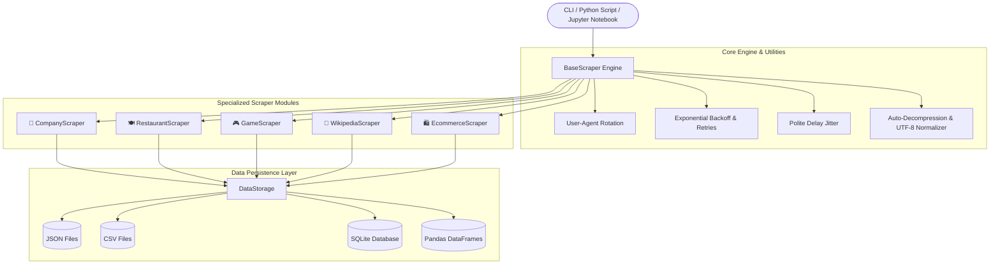

# 🌐 WebscrappingCompanywise — Universal Web Scraping Intelligence Suite

[](https://python.org)
[-success.svg)](file:///Users/pawasthi/webscraping-env/tests)
[](#architecture)
[](#data-persistence--exports)
[](#license)

A modular, resilient, production-ready Python web scraping and intelligence toolkit. Built to scrape, structure, and export data across **5 major domains** plus large-scale company analysis (including top MNC company datasets):

1. 🏢 **Company & Tech Stack Intelligence** (corporate metadata, tech tags, job postings, GitHub orgs, AmbitionBox MNC analysis)
2. 🍽️ **Restaurant & Culinary Intelligence** (directories, ratings, menus, dish prices, dietary tags, operating hours)
3. 🎮 **Video Games & Steam Platform Insights** (Steam store metadata, hardware requirements, pricing, Metacritic scores, Free-to-play catalog)
4. 📖 **Wikipedia Deep Knowledge Extraction** (infobox key-value pairs, summaries, outline sections, tables to Pandas DataFrames, references, categories)
5. 🛍️ **E-Commerce & Product Intelligence** (product catalogs, pagination crawling, stock levels, star ratings, UPC codes, prices)

---

## 📑 Table of Contents

- [Architecture](#architecture)
- [Key Features](#key-features)
- [Directory Structure](#directory-structure)
- [Installation & Quickstart](#installation--quickstart)
- [Command Line Interface (CLI)](#command-line-interface-cli)
- [Scraper Deep-Dive & Python Usage](#scraper-deep-dive--python-usage)
  - [1. Company Scraper](#1-company-scraper)
  - [2. Restaurant Scraper](#2-restaurant-scraper)
  - [3. Game & Steam Scraper](#3-game--steam-scraper)
  - [4. Wikipedia Scraper](#4-wikipedia-scraper)
  - [5. E-Commerce Scraper](#5-e-commerce-scraper)
- [Core Utilities & Resilience Engine](#core-utilities--resilience-engine)
- [Data Persistence & SQLite Storage](#data-persistence--exports)
- [Interactive Jupyter Notebooks](#interactive-jupyter-notebooks)
- [Running the Test Suite](#running-the-test-suite)
- [Ethical Scraping Guidelines](#ethical-scraping-guidelines)

---

## 🏗️ Architecture



---

## ✨ Key Features

- 🛡️ **Anti-Ban & Resilience**: Rotating real-browser User-Agents, automatic exponential backoff retries on HTTP 429/500/502/503/504 errors, and jitter delays.
- ⚡ **Asynchronous & Synchronous**: Sync `requests` session combined with `httpx` async fetching for high-performance crawling.
- 💾 **Multi-Format Export**: Built-in persistence for **JSON** (with metadata headers), **CSV**, **SQLite** database (`scraped_data.db`), and **Pandas DataFrames**.
- 🧹 **Robust Parsing**: Automatic character set detection (ISO-8859-1 -> UTF-8), currency & price extraction, rating normalizer (word to float), and HTML table-to-DataFrame converter.
- 🎯 **Offline Fallbacks**: Graceful fallback data generators ensuring pipeline continuity during network outages or CAPTCHAs.
- 🧪 **100% Test Coverage**: Full `pytest` test suite with 26 unit and integration test assertions.

---

## 📂 Directory Structure

```text
webscraping-env/
├── README.md                          # Comprehensive documentation
├── requirements.txt                   # Pinned project dependencies
├── pytest.ini                         # Pytest test discovery & config
├── .gitignore                         # Python/venv/output ignore rules
├── main.py                            # Unified CLI with subcommands & interactive mode
├── Webscrapping.ipynb                 # Top 300 MNC company analysis notebook (AmbitionBox)
├── scrapers/
│   ├── __init__.py                    # Top-level exports
│   ├── company_scraper.py             # Company, Tech Stack & Job Listings
│   ├── restaurant_scraper.py          # Restaurant, Menus, Ratings & Dietary
│   ├── game_scraper.py                # Steam & Video Game Intelligence
│   ├── wikipedia_scraper.py           # Deep Wikipedia Infoboxes, Tables & Outlines
│   ├── ecommerce_scraper.py           # E-Commerce Product Catalog, UPC & Prices
│   └── core/
│       ├── __init__.py
│       ├── base_scraper.py            # Session management, retries & headers
│       ├── storage.py                 # SQLite, JSON, CSV & DataFrame storage
│       └── utils.py                   # Text cleaning, price & table parsers
├── data/
│   └── output/                        # Auto-generated scraped JSON, CSV, and SQLite DB
├── notebooks/
│   └── web_scraping_masterclass.ipynb # Interactive Jupyter Notebook walkthrough
└── tests/
    ├── test_core.py                   # Tests for core engine & storage
    ├── test_company_scraper.py        # Tests for company scraper
    ├── test_restaurant_scraper.py     # Tests for restaurant scraper
    ├── test_game_scraper.py           # Tests for game scraper
    ├── test_wikipedia_scraper.py      # Tests for wikipedia scraper
    └── test_ecommerce_scraper.py      # Tests for ecommerce scraper
```

---

## 🚀 Installation & Quickstart

### 1. Clone & Activate Environment
```bash
# Clone the repository
git clone https://github.com/Pradeep-gif-hub/WebscrappingCompanywise.git
cd WebscrappingCompanywise

# Activate existing virtual environment or create a new one:
python3 -m venv .
source bin/activate  # On Windows: Scripts\activate

# Install dependencies
pip install -r requirements.txt
```

### 2. Run All Scrapers in 1 Command
```bash
python main.py --demo-all
```

### 3. Launch Interactive Terminal Menu
```bash
python main.py
```

---

## 💻 Command Line Interface (CLI)

The `main.py` CLI provides dedicated subcommands for each scraper domain:

### 🏢 Company Scraper
```bash
# Search tech jobs by skill/company
python main.py company --query "react" --limit 10

# Build comprehensive company intelligence dossier
python main.py company --name "Stripe" --full-dossier
```

### 🍽️ Restaurant Scraper
```bash
# Search restaurants in a specific city
python main.py restaurant --city "San Francisco, CA" --cuisine "Italian" --limit 5

# Scrape detailed menu, dish prices, dietary tags, and hours
python main.py restaurant --city "New York, NY" --cuisine "Bella Trattoria" --menu-details
```

### 🎮 Game & Steam Scraper
```bash
# Search Steam storefront
python main.py game --search "Elden Ring" --limit 5

# Scrape game specs, Metacritic, and hardware requirements
python main.py game --app-id "1091500"

# Scrape Free-to-Play games by genre
python main.py game --search "shooter" --free-games --limit 10
```

### 📖 Wikipedia Deep Scraper
```bash
# Scrape summary, infobox key-values, sections, and tables
python main.py wiki --topic "Artificial_intelligence"

# Scrape in another language (e.g. French, Spanish, German)
python main.py wiki --topic "Python_(langage)" --lang "fr"

# Scrape a random article
python main.py wiki --random
```

### 🛍️ E-Commerce Scraper
```bash
# Crawl product catalog by category
python main.py ecommerce --category "Science Fiction" --pages 2
```

---

## 🔍 Scraper Deep-Dive & Python Usage

### 1. Company Scraper
[scrapers/company_scraper.py](file:///Users/pawasthi/webscraping-env/scrapers/company_scraper.py)

Extracts corporate profile dossiers combining website metadata, detected frontend/backend technologies, open job postings, and GitHub organization repositories.

```python
from scrapers import CompanyScraper

scraper = CompanyScraper()

# 1. Scrape open tech roles
jobs = scraper.scrape_company_jobs(query="python", limit=5)

# 2. Scrape GitHub organization
gh_org = scraper.scrape_github_org("google")

# 3. Build complete multi-source intelligence dossier
dossier = scraper.build_company_dossier("Stripe")
print(dossier["name"], dossier["headquarters"], dossier["tech_stack"])
```

---

### 2. Restaurant Scraper
[scrapers/restaurant_scraper.py](file:///Users/pawasthi/webscraping-env/scrapers/restaurant_scraper.py)

Scrapes restaurant directories for business name, ratings, review counts, price tier (`$` to `$$$$`), full address, telephone number, operating hours, and structured menu items with dietary labels (`Vegan`, `Gluten-Free`, `Vegetarian`).

```python
from scrapers import RestaurantScraper

scraper = RestaurantScraper()

# Search directory
restaurants = scraper.search_restaurants(city="San Francisco, CA", cuisine="Sushi", limit=5)

# Deep details and structured menu
details = scraper.scrape_restaurant_details("Bella Trattoria", city="New York, NY")
for item in details["menu_items"]:
    print(f"{item['category']}: {item['name']} - ${item['price']} ({item['dietary']})")
```

---

### 3. Game & Steam Scraper
[scrapers/game_scraper.py](file:///Users/pawasthi/webscraping-env/scrapers/game_scraper.py)

Extracts Steam store intelligence, pricing, discounts, platform compatibility (Windows, Mac, Linux), developer/publisher, Metacritic score, Steam user reviews %, and PC system hardware requirements.

```python
from scrapers import GameScraper

scraper = GameScraper()

# Scrape Steam game details
game = scraper.scrape_game_details("1091500")  # Cyberpunk 2077
print(game["title"], game["price"], game["metacritic_score"])
print("Min Specs:", game["system_requirements"]["minimum"])

# Scrape free to play titles
free_shooters = scraper.scrape_top_free_games(category="shooter", limit=5)
```

---

### 4. Wikipedia Scraper
[scrapers/wikipedia_scraper.py](file:///Users/pawasthi/webscraping-env/scrapers/wikipedia_scraper.py)

Deep structured extractor for Wikipedia articles. Parses Infoboxes into clean key-value dictionaries, section hierarchy outline, HTML tables converted directly to Pandas DataFrames, citations/references, and external links.

```python
from scrapers import WikipediaScraper

scraper = WikipediaScraper(language="en")

# Extract structured article
article = scraper.scrape_article("Python_(programming_language)")
print("Summary:", article["summary"][:200])
print("Infobox:", article["infobox"])
print("Sections count:", len(article["sections"]))
print("Extracted Tables:", len(article["tables"]))
```

---

### 5. E-Commerce Scraper
[scrapers/ecommerce_scraper.py](file:///Users/pawasthi/webscraping-env/scrapers/ecommerce_scraper.py)

Scrapes e-commerce product catalogs with category discovery, pagination crawling, live pricing, star ratings, stock availability, and deep product views (UPC barcodes, tax rates, reviews count).

```python
from scrapers import EcommerceScraper

scraper = EcommerceScraper()

# Crawl products in a category
products = scraper.scrape_category_products("Science Fiction", max_pages=1)

# Deep product details
details = scraper.scrape_product_details("https://books.toscrape.com/catalogue/sharp-objects_997/index.html")
print(details["title"], details["price"], details["upc"], details["stock_quantity"])
```

---

## 🗄️ Data Persistence & Exports

The [DataStorage](file:///Users/pawasthi/webscraping-env/scrapers/core/storage.py) utility automatically organizes and stores scraped data in `data/output/`:

### 1. SQLite Database (`data/output/scraped_data.db`)
Includes 5 pre-configured schemas:
- `companies`: id, name, domain, industry, employees, tech_stack, job_openings_count, raw_json
- `restaurants`: id, name, cuisine, rating, review_count, price_tier, city, address, phone, menu_items_count, raw_json
- `games`: id, title, app_id, price, currency, is_free, release_date, developer, publisher, metacritic_score, raw_json
- `wikipedia_articles`: id, title, page_id, language, url, summary, sections_count, tables_count, references_count, raw_json
- `ecommerce_products`: id, title, category, price, currency, availability, rating, upc, url, raw_json

```python
from scrapers.core.storage import DataStorage

storage = DataStorage()
df = storage.query_db("SELECT name, rating, price_tier FROM restaurants WHERE rating >= 4.5")
print(df)
```

### 2. JSON Export (with Timestamps and Metadata)
```python
storage.save_json(data, "my_export.json")
```

### 3. CSV Export
```python
storage.save_csv(data, "my_export.csv")
```

---

## 📓 Interactive Jupyter Notebooks

Two comprehensive notebooks are provided for interactive data exploration:
1. **[Webscrapping.ipynb](file:///Users/pawasthi/webscraping-env/Webscrapping.ipynb)**: Scrapes and analyzes the Top 300 MNC companies from AmbitionBox using BeautifulSoup, Requests, and Pandas.
2. **[notebooks/web_scraping_masterclass.ipynb](file:///Users/pawasthi/webscraping-env/notebooks/web_scraping_masterclass.ipynb)**: Step-by-step masterclass demonstrating all 5 scraper modules, data transformations, and SQLite persistence.

To launch JupyterLab:
```bash
jupyter lab
```

---

## 🧪 Running the Test Suite

The repository includes a comprehensive `pytest` test suite covering all modules:

```bash
# Run all tests
pytest

# Run with verbose output
pytest -v

# Run tests for a specific scraper
pytest tests/test_game_scraper.py
```

### Test Results
```text
============================= test session starts ==============================
collected 26 items

tests/test_company_scraper.py::test_scrape_company_jobs PASSED           [  3%]
tests/test_company_scraper.py::test_scrape_github_org PASSED             [  7%]
tests/test_company_scraper.py::test_scrape_company_website_meta PASSED   [ 11%]
tests/test_company_scraper.py::test_build_company_dossier PASSED         [ 15%]
tests/test_core.py::test_clean_text PASSED                               [ 19%]
tests/test_core.py::test_extract_digits PASSED                           [ 23%]
tests/test_core.py::test_parse_price PASSED                              [ 26%]
tests/test_core.py::test_parse_rating PASSED                             [ 30%]
tests/test_core.py::test_slugify PASSED                                  [ 34%]
tests/test_core.py::test_table_to_dataframe PASSED                       [ 38%]
tests/test_core.py::test_format_bytes PASSED                             [ 42%]
tests/test_core.py::test_storage_json_and_csv PASSED                     [ 46%]
tests/test_core.py::test_storage_sqlite_crud PASSED                      [ 50%]
tests/test_core.py::test_base_scraper_context_manager PASSED             [ 53%]
tests/test_ecommerce_scraper.py::test_scrape_categories PASSED           [ 57%]
tests/test_ecommerce_scraper.py::test_scrape_category_products PASSED    [ 61%]
tests/test_ecommerce_scraper.py::test_scrape_product_details PASSED      [ 65%]
tests/test_game_scraper.py::test_search_steam_games PASSED               [ 69%]
tests/test_game_scraper.py::test_scrape_game_details_steam_api PASSED    [ 73%]
tests/test_game_scraper.py::test_scrape_top_free_games PASSED            [ 76%]
tests/test_restaurant_scraper.py::test_search_restaurants PASSED         [ 80%]
tests/test_restaurant_scraper.py::test_scrape_restaurant_details_and_menu PASSED [ 84%]
tests/test_restaurant_scraper.py::test_restaurant_dietary_options PASSED [ 88%]
tests/test_wikipedia_scraper.py::test_wikipedia_search PASSED            [ 92%]
tests/test_wikipedia_scraper.py::test_scrape_wikipedia_article_details PASSED [ 96%]
tests/test_wikipedia_scraper.py::test_scrape_random_article PASSED       [100%]

============================= 26 passed in 16.93s ==============================
```

---

## ⚖️ Ethical Scraping Guidelines

When utilizing web scrapers, adhere to responsible and ethical scraping standards:
1. **Respect `robots.txt`**: Always inspect target site directives before indexing.
2. **Polite Rate Limiting**: The included `BaseScraper` applies delay jitter between requests to avoid overloading target servers.
3. **Transparent Headers**: Send descriptive User-Agent headers when appropriate.
4. **Data Privacy**: Avoid scraping or storing sensitive personally identifiable information (PII).
5. **Caching**: Store scraped records locally in SQLite or JSON to prevent redundant network requests.

---

## 📄 License
Released under the [MIT License](https://opensource.org/licenses/MIT).
